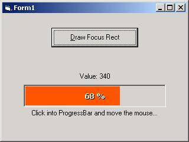



## Enhance default ProgressBar

### Description

This code show how to use Windows API to change the bar color of the Windows ProgressBar. Draw percent value into the ProgressBar.              

----

PLEASE, DON´T FORGET TO VOTE 

----

Este código demonstra como utilizar as APIs do Windows p/ alterar as cores e escrever texto dentro da ProgressBar default do Windows.      

----

POR FAVOR, NÃO SE ESQUEÇA DE VOTAR 

----

 
### More Info
 

             |
---                |---
**Submitted On**   |2002-01-17 10:33:52
**By**             |[Eduardo Schoedler](https://github.com/Planet-Source-Code/PSCIndex/blob/master/ByAuthor/eduardo-schoedler.md)
**Level**          |Advanced
**User Rating**    |4.4 (80 globes from 18 users)
**Compatibility**  |VB 5\.0, VB 6\.0
**Category**       |[Windows API Call/ Explanation](https://github.com/Planet-Source-Code/PSCIndex/blob/master/ByCategory/windows-api-call-explanation__1-39.md)
**World**          |[Visual Basic](https://github.com/Planet-Source-Code/PSCIndex/blob/master/ByWorld/visual-basic.md)
**Archive File**   |[Enhance\_de492881172002\.zip](https://github.com/Planet-Source-Code/eduardo-schoedler-enhance-default-progressbar__1-30886/archive/master.zip)

### API Declarations

Various. See code.

